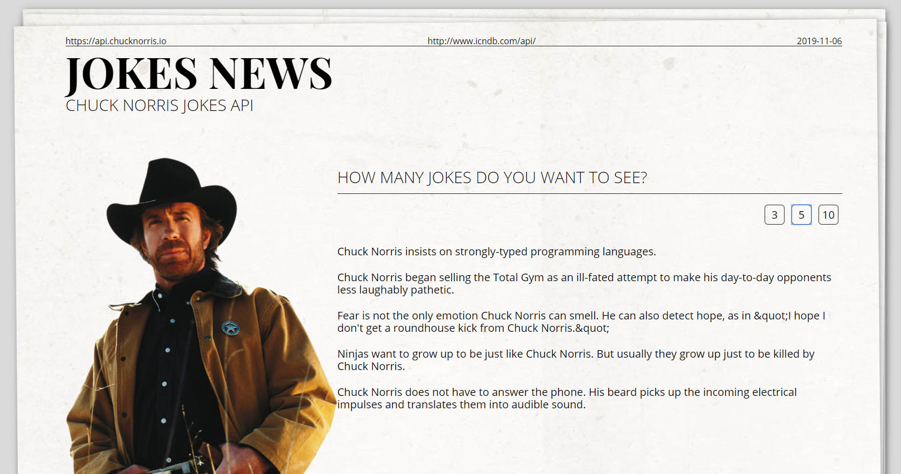

# Jokes REST API
If you want to know how my portfolio looks like click here -> [jokesapi.criscode.pl](http://jokesapi.criscode.pl/)

## The aim of this project 🚀
My aim of this project is using external API and fetching data using React.js as the main environment.

## What I've used here?
- 👍 Semantic HTML5
- 👍 CSS Modules and SASS
- 👍 BEM methodology
- 👍 Adobe XD
- 👍 React.js
- 👍 Rest Api - from (http://www.icndb.com/api/)

## The tools I've used:
- ✔ Visual Studio Code
- ✔ Adobe XD,
- ✔ Create React App
